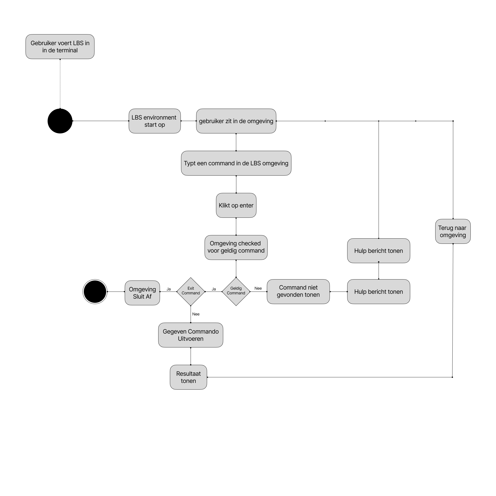

Datum: 27 / 09 / 2026

# Inleiding
Dit document beschrijft de technische architectuur en de realisatie van het Lokaal Back-Up Systeem, gebaseerd op de functionele eisen. In het document [[( B.1 ) Functioneel Ontwerp - Lokaal Back-up Systeem]] bevindt zich de informatie over de applicatie. De doelstelling van dit document is om de functionaliteiten/use-cases te realiseren en uit te pakken. De keuzes gemaakt in dit document zijn gebaseerd op de tijd gegeven voor het project (4 weken). 
# Plan van aanpak
In de applicatie LBS (Lokaal Back-Up Systeem) zijn er twee verschillende producten vastgesteld. Waarvan het hoofdproduct het LBS programma is en als zijproduct de documentatie website. 

### 1. Hoofdproduct LBS Programma
Het LBS programma is een Command-Line Applicatie dat in de terminal uitgevoerd wordt. Het programma heeft zijn eigen omgeving waar je in kan, de omgeving zelf hoef je niet in te gaan om het programma te gebruiken. Je kan het programma ook buiten de omgeving aanroepen. 
LBS zorgt er voor dat een back-up maken van meerdere bestanden eenvoudig gedaan kan worden. Hiervoor worden er backupbestanden aangemaakt. Die de gebruiker kan aanroepen om een back-up te maken/op te halen. Zodra een gebruiker een back-up maakt of update zal het programma de geupdate back-up een identificatienummer geven, hiermee kan de gebruiker ook oud versies terughalen. 

Soms kan het zijn dat de gebruiker niet weet wat hij moet typen. Hiervoor is er een hulp command voor de gebruiker. Deze command dient als hulpmiddel maar zal niet uitgebreid uitleg staan voor een command maar dient meer als basisinformatie. Voor een uitgebreidere uitleg zal de gebruiker naar de documentatiewebsite moeten gaan (<U>Zijproduct LBS Documentatie Website</U>).

### 2. Zijproduct LBS Documentatie Website
De documentatie website zal een website zijn waar er een uitgebreide gebruikershandleiding in zal staan. Hierbij kan de gebruiker command's opzoeken die voor het programma LBS zijn gemaakt. Deze website dient dus als gebruikershandleiding.

Voor de documentatiewebsite hoeft er niet getest te worden. Sinds het niet uit maakt als er bugs in de website zitten. Het dient alleen om goed tekst te laten zien.
## Planning

| Dag      | Fase                   | Taak                                |                                                                                                                                                                                                                                    |      Uren       |
| :------- | ---------------------- | :---------------------------------- | ---------------------------------------------------------------------------------------------------------------------------------------------------------------------------------------------------------------------------------- | :-------------: |
| 21-9-26  | Requirements & Analyse | Projectplan                         | Een volledig Project plan hebben opgesteld. Met een MoSCoW, Fasering, Planning en een kort maar krachtig uitleg over het project en het gewenste resultaat.                                                                        |        4        |
| 25-9-26  | Design                 | Functioneel ontwerp                 | De functionele eisen vaststellen met de gewenste situatie. In het document bevindt zich ook een complete use-case diagram/scenario's.                                                                                              |        4        |
| 28-9-26  | Design                 | Technisch ontwerp                   | De technische randvoorwaarden worden vastgesteld in het technisch ontwerp, met een duidelijk beeld wat voor ontwikkel-methodes/programeertalen er worden gebruikt. Hierbij komt ook de architectuur van het programma in te staan. |        2        |
| 29-9-26  | Testing                | Testcases                           | In het bestand komen de testcases van het programma te staan om specifieke situaties te testen.                                                                                                                                    |        2        |
| 29-9-26  | Testing                | Testplan                            | In het tesplan wordt er uitgelegd waarom, hoe, wie, wat en waar de testcases worden getest. Het document omschrijft hoe het testen zich zal uitoefenen.                                                                            |        3        |
| 29-9-26  | Realisatie             | Project Opzetten                    | Hier wordt het project opgestart, hierbij zal het project opgezet moeten worden. Dus de ontwikkelmethode, programmeertalen en github-repository zullen moeten opgezet worden.                                                      |       0.5       |
| 29-9-26  | Realisatie             | Programmeren                        |                                                                                                                                                                                                                                    |        8        |
| 30-9-26  | Requirements & Analyse | Meeting met Product-Owner           | Een gesprek houden met de product-owner om afspraken te maken om wekelijks een uur te plannen om ontwikkelingen te laten zien en actief feedback te krijgen                                                                        |        1        |
| 30-9-26  | Realisatie             | Programmeren                        |                                                                                                                                                                                                                                    |        7        |
| 2-10-26  | Realisatie             | Programmeren                        |                                                                                                                                                                                                                                    |        8        |
| 5-10-26  | Realisatie             | programmeren                        |                                                                                                                                                                                                                                    |        8        |
| 5-10-26  | Requirements & Analyze | Meeting aanvragen mat Product owner | Om te overleggen wat de product-owner graag wilt zien van het project.                                                                                                                                                             |        X        |
| 7-10-26  | Requirements & Analyze | Gesprek met product-owner           | Over het project praten, wat de product-owner graag terug ziet in het project.                                                                                                                                                     |       0.5       |
| 7-10-26  | Testing                | Testen                              | Het testen van de applicatie met een aantal willekeurige klasgenoten. Zij zullen actief feedback geven op de applicatie dat zich in het test-rapport zal bevinden                                                                  |        1        |
| 7-10-26  | Testing                | Testrapporten typen                 | Het testrapport wordt actief getypt wanneer het testen bezig is.                                                                                                                                                                   | Tijdens testen* |
| 9-10-26  | Realisatie             | programmeren                        |                                                                                                                                                                                                                                    |        8        |
| -        | -                      | Herfstvakantie                      |                                                                                                                                                                                                                                    |        -        |
| 19-10-26 | Realisatie & Testing   | Bufferdag                           | Het afmaken van achterstanden en het testen van de applicatie.                                                                                                                                                                     |        -        |
| 21-10-26 | Realisatie             | Bufferdag                           | Het afmaken van achterstanden. Indien het LBS programma af is zal er worden gewerkt aan de documentatiewebsite.                                                                                                                    |        -        |
| 23-10-26 | Testing                | Testen                              | het testen van de applicatie                                                                                                                                                                                                       |        8        |
| 25-10-26 | Oplevering             | Opleveren van Product               | Het product overdragen aan de product owner.                                                                                                                                                                                       |        4        |

# Interfaces

### LBS
1. LBS Omgeving
	In de LBS omgeving zal het programma actief aan zijn. Hierbij kan de gebruiker een command typen en uitvoeren zodra er op "enter" wordt gedrukt. Wanneer dit gebeurt zal het systeem actief informatie laten zien als pure text.
2. Terminal
	In de terminal kan LBS ook kunnen aangeroepen worden. Hierbij zal er een andere wijze zijn van hoe de command's worden getypt. Het programma zal net als in de omgeving actief informatie tonen in de vorm van tekst.
### Backupbestanden
LBS regelt het uitlezen van de backupbestanden. De backupbestanden zijn op zichzelf tekst bestanden. Elke lijn in een backupbestand is een bestandspad of een folderspad. LBS weet wanneer het gegeven pad een folder/bestand is door te kijken of er een "." in de lijn staat.
Elke bestand/folder heeft een "identificatie" achter het pad hebben. Dit kan zijn "FILE" of "FOLDER".

Hieronder is een voorbeeld van een backupbestand
```
BACKUP

FILE /usr/dev/documents/file1.txt
FOLDER /usr/dev/documents/folder
FILE /usr/dev/documents/file2.txt
FILE /usr/dev/documents/file3.txt
```

### Versiebeheerbestanden
In het versiebeheerbestand staan alle veranderingen in van elke versie. LBS regelt het versiebeheer. Zodra een back-up geupdate is zal lbs de vorige versie vergelijken met de nieuwe geupdate back-up. Elke versie krijgt een identificatienummer (ID), deze wordt getypt als: `[1]` voor elke update zal de nieuwe versie het vorige identificatienummer + 1  worden. Het versiebeheerbestand is ook net als het backupbestand geschreven in tekst.
Voor elk bestand komt FILE voor te staan, hierdoor weet LBS welk bestand er werd aangepast. Voor elke lijn die aangepast is zal er een "+" of een "-" zijn, deze tekens betekenen of er een lijn is aangepast/toegevoegd. Het nummer dat na de +/- komt is de lijn dat aangepast is. Als er een lijn is aangepast dat alle andere lijnen een lijn naar onder brengt zullen al deze lijnen een nieuw lijnnummer krijgen. 

Hieronder is een voorbeeld van een versiebeheerbestand
```
VERSIONCONTROL

[1]
FILE /usr/dev/documents/file.txt
+1 Hello there
+2 Made by Senna
+3 This is a line

[2]
FILE /usr/dev/documents/file.txt
-2 Made by Senna

[3]
FILE /usr/dev/documents/file.txt
+1 Hello there user!
+2 This is not a line!!!!

[4]
FILE /usr/dev/documents/file.txt
+1 Hello there user!
+2 Made by Administrator 
+3 This is not a line!!!!
```
# Ontwikkelomgeving

### Technischeinfrastructuur
**Beveiliging**
Voor LBS geldt dat alles lokaal gedaan moet worden, hierbij zullen er geen netwerkconnecties zijn die verbonden zijn aan aanliggende api's: sinds het programma geen data naar een database zal sturen.
**Opslag van data**
Er zijn twee bestanden die nodig zijn om een back-up te maken, dit zijn: Backupbestanden en Versiebeheerbestanden. Daarnaast zijn er ook nog de gemaakte back-ups. De backupbestanden en versiebeheerbestanden zijn in principe alleen voor LBS om de benodigde bestanden/folders op te slaan of op te halen. Waarbij de back-ups de resultaten zijn.

De backupbestanden zullen zich bevinden in een folder genaamd: "LBS/backup-files/", deze folder zal dus ook zich bevinden op het pad waar LBS is gedownload. 

Voor de versiebeheerbestanden geldt hetzelfde, deze bestanden zullen zich bevinden op het pad: "LBS/backup-versions/".

De opgeslagen back-ups worden opgeslagen in folders, deze folders bevinden zich op het pad: /usr/dev/backups/**BACK-UP NAAM**. 

***Vereiste software en runtime***
Om LBS te kunnen uitvoeren heeft de gebruiker GCC nodig om het bestand te kunnen compileren, er zal 'waarschijnlijk' ook een standalone binary komen waarbij de gebruiker dit niet nodig heeft. De runtime van het programma zal zich in de terminal bevinden. Dus wanneer de gebruiker een terminal opened zal de runtime actief zijn. De terminal zal wel 
#### Schema's
##### Activity Diagram


### Ontwikkeltools
Voor dit project worden er verschillende "tools" gebruikt. Die staan hieronder bescreven.

##### Programmeertalen
De programmeer talen voor dit systeem zullen **C** en **LUA** zijn. Dit is gekozen omdat C snel is voor belangrijke taken en Lua zich goed kan koppelen onder C, sinds Lua een klein programmeertaal is geschreven in C. 

-- Samenvatting Programmeertalen --
- C
- Lua

##### Versiebeheersysteem
Voor het versiebeheer wordt er gebruik gemaakt van **Github**, sinds github versiebeheer makkelijk in combinatie van **Git** maakt, git wordt gebruikt voor het committen en pushen van een nieuwe versie dat Github dan weer opslaat.

-- Samenvatting Versiebeheersysteem --
- Github
- Git

##### IDE (Code Editor)
Code editors verschillen bij veel programmeurs, sinds er veel bestaan. Bij dit project zal ik (de programmeur) gebruik maken van NeoVim (Nvim). Dit komt omdat Nvim snel opstart, handig is om tekst te veranderen, opzoeken of verwijderen. 

-- Samenvatting IDE --
- Neovim | Snel & Praktisch

##### Testtools
Voor het testen wordt er gebruik gemaakt van een terminal. De terminal kan zijn: **Alacritty**, **Kitty**, **Konsole**, **WezTerm**. Uiteindelijk kan er een mogelijkheid zijn dat er **Powershell** ook zal werken maar de manier hoe windows de bestandspaden heeft met "\\" is erg onpraktisch.

-- Samenvatting testtools --
- Alacritty / Kitty / Konsole / WezTerm | Gemaakt voor unix
- ? Powershell | ? Windows terminal 

##### Documentatie- en Projectmanagementtools
Voor dit project zullen er een paar documentatie/projectmanagement tools worden gebruikt. De documentatie die is geschreven voor dit project wordt gedaan in **Obsidian**. Dit is een markdown text editor om gemakkelijk markdown te typen.

Daarnaast voor de diagrammen wordt er gebruik gemaakt van **Figma**, dit programma wordt veel gebruikt onder de "Mediaformgevers" en is mij aanbevolen door een student die zelf ook die opleiding doet. 

Het project is opgeslagen op Github, dit is gedaan omdat Github ook al het versiebeheer regelt. Hiervoor kan je dus ook gemakkelijk oude versies terughalen van de documentatie.

-- Samenvatting Documentatie/Projectmanagementtools --
- Obsidian | Tekst Editor
- Figma | Diagrammen
- Github | Opslaan

# Activiteit Diagram
